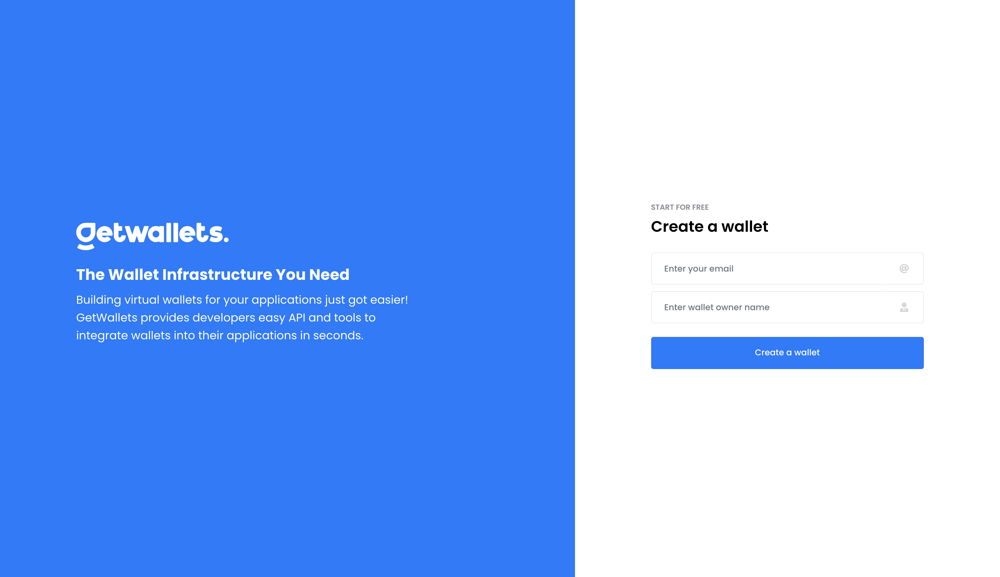

# Introduction
Deloyed on Vercel: [https://getwallets.vercel.app/](https://getwallets.vercel.app/)




# Getting Started 🚀
> A simple app to explore GetWallets APIs 
https://docs.getwallets.co/reference/post_wallets
## Project Structure
> Understand how all the different bits and pieces work together.

    .
    ├── ...
    ├── src                     # Main directory for most project files
    │   ├── assets              # Non-code files like images, fonts
    │   ├── components          # Page/element components, HOCs
    │   ├── hooks               # Custom react hooks (eg validation hook)
    │   ├── redux               # For storing redux state management logic
    │   │   ├──── slices        # Reducer and actions logic
    │   │   └──── store         # App state container.
    │   │   
    │   ├── router              # React router 6 config
    │   ├── sass                # SASS variables & root file
    │   ├── services            # Services classes for for HTTP req of API calls
    │   ├── utils               # Simple reusable helper functions
    └── ...

## Setup
First, run the development server:

```bash
    npm i
    npm start
# or
    yarn install
    yarn start
```

## Environment Variables
```bash
    NODE_ENV=dev||prod
```

Open [http://localhost:3000](http://localhost:3000) with your browser to see the result.

You can start editing the page by modifying `pages/index.js`. The page auto-updates as you edit the file.
</div>


<div style="margin-bottom:2em">

## Learn More About Create React App

You can learn more in the [Create React App documentation](https://facebook.github.io/create-react-app/docs/getting-started).

To learn React, check out the [React documentation](https://reactjs.org/).

</div>


<div style="margin-bottom:2em">

# Special Thanks To

[ Vercel ](https://vercel.com/) for sponsoring this project's hosting

[](https://vercel.com/import/git?s=https://github.com/shal0mdave/https://github.com/shal0mdave/getwallets-react-assessment)


</div>

<!-- # Learn More About Next.js Here -->
